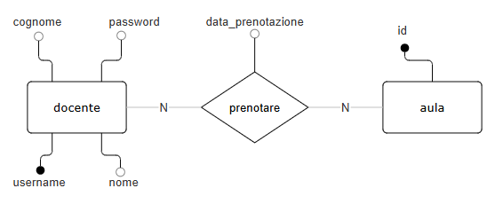

#progetto scolastico per esercitazione

questo è un progetto scolastico che serve per esercitarzi sulla programmazione di pagine dinamiche con php, il sito è collegato ad un database SQL locale hostato con xampp.
Il progetto richiede la realizzazione di un sito scolastico che permetta ai docenti (utenti autenticati) di gestire le prenotazioni di aule scolastiche.

il database si compone di 2 tabelle: 
- docenti
- aule_scolastiche

## schema E/R


Il sito deve permettere ai docenti di compiere le seguenti operazioni sul database:
- visualizzazione di tutte le relazioni
- prenotazione di aule da parte di utenti autenticati
- eliminazione delle prenotazioni da parte di utenit autenticati

## schema logico 
- aule_risorse (<u>id<u>) 
- docenti (<u>username</u>, nome, cognome, password) 
- prenotare(<u>username</u>, <u>id</u>, data_prenotazione) 


## 🛠️ Requisiti
- PHP >= 7.4
- Composer
- MySQL / MariaDB 
- Estensioni PHP necessarie: vlucas/phpdotenv


## ⚙️ Installazione

### 1. Clona il progetto:

   ```bash
   git clone https://github.com/XbiteX/prenotazione_aule
   cd prenotazione_aule
   ```

### 2. Creazione del database:
#### sul tuo DBMS esegui i seguenti comandi:

creazione database e tabelle
   ```SQL
   CREATE DATABASE prenotazione_aule 
   
   USE prenotazione_aule 
   
   CREATE TABLE aule_risorse( 
       id int PRIMARY KEY 
       )
   CREATE TABLE docenti(  
       username int PRIMARY KEY AUTO_INCREMENT,  
       nome varchar(20) NOT NULL,  
       cognome varchar(20) NOT NULL,  
       password char(16) NOT NULL  
       ) 
   
   CREATE TABLE prenotare(  
       username int NOT NULL,  
       id int NOT NULL,  
       data_prenotazione datetime NOT NULL, 
       PRIMARY KEY (username, id), 
       FOREIGN KEY (username) REFERENCES docenti(username), 
       FOREIGN KEY (id) REFERENCES aule_risorse(id) 
       ) 
   ```


popolamento tabelle
   ```SQL
   INSERT INTO aule_risorse (id) VALUES (1); 
   INSERT INTO aule_risorse (id) VALUES (2); 
   INSERT INTO aule_risorse (id) VALUES (3); 
   INSERT INTO aule_risorse (id) VALUES (4); 
   INSERT INTO aule_risorse (id) VALUES (5); 
   INSERT INTO aule_risorse (id) VALUES (6); 
   INSERT INTO aule_risorse (id) VALUES (7); 
   INSERT INTO aule_risorse (id) VALUES (8); 
   INSERT INTO aule_risorse (id) VALUES (9); 
   INSERT INTO aule_risorse (id) VALUES (10); 
   
   INSERT INTO docenti (nome, cognome, password) VALUES ('Giovanni', 'Rossi', 'password1234567890'); 
   INSERT INTO docenti (nome, cognome, password) VALUES ('Maria', 'Bianchi', 'password1234567890'); 
   INSERT INTO docenti (nome, cognome, password) VALUES ('Antonio', 'Verdi', 'password1234567890'); 
   INSERT INTO docenti (nome, cognome, password) VALUES ('Luisa', 'Neri', 'password1234567890'); 
   INSERT INTO docenti (nome, cognome, password) VALUES ('Francesco', 'Gialli', 'password1234567890'); 
   
   INSERT INTO prenotare (username, id, data_prenotazione) VALUES (1, 1, '2025-03-29 09:00:00'); 
   INSERT INTO prenotare (username, id, data_prenotazione) VALUES (2, 2, '2025-03-29 10:00:00'); 
   INSERT INTO prenotare (username, id, data_prenotazione) VALUES (3, 3, '2025-03-29 11:00:00'); 
   INSERT INTO prenotare (username, id, data_prenotazione) VALUES (4, 4, '2025-03-29 12:00:00'); 
   INSERT INTO prenotare (username, id, data_prenotazione) VALUES (5, 5, '2025-03-29 13:00:00'); 
   INSERT INTO prenotare (username, id, data_prenotazione) VALUES (1, 6, '2025-03-30 09:00:00'); 
   INSERT INTO prenotare (username, id, data_prenotazione) VALUES (2, 7, '2025-03-30 10:00:00'); 
   INSERT INTO prenotare (username, id, data_prenotazione) VALUES (3, 8, '2025-03-30 11:00:00'); 
   INSERT INTO prenotare (username, id, data_prenotazione) VALUES (4, 9, '2025-03-30 12:00:00'); 
   INSERT INTO prenotare (username, id, data_prenotazione) VALUES (5, 10, '2025-03-30 13:00:00'); 
   ```


sul tuo DBMS esegui i seguenti comandi:
   ```SQL
   CREATE DATABASE prenotazione_aule 
   
   USE prenotazione_aule 
   
   CREATE TABLE aule_risorse( 
       id int PRIMARY KEY 
       ) 
   ```
